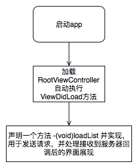
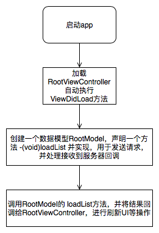

# PSNetworkManager的由来

大多数app的功能都会依赖 `Web Service` 。如果app采用 `MVC` 架构，会面临一个问题：**网络请求在哪里实现？**

大部分情况下，我们会将网络请求放在 `ViewController` 的事件触发方法中。

假设某app的启动流程如下图所示：



这么实现虽然很直观，但也可能会导致以下问题：

```
如果另外一个界面也调用了这个接口，但因为界面逻辑不同，就需要在另一个界面重新实现一遍。
```


因此我们很自然的会想到把请求封装到一个model中：



这样做的`优势`：

* 将请求和UI分开，提高了UI的灵活性；
* 请求和数据模型绑定，提高了接口请求的复用性；
* 这一过程是将请求“模型化”的过程，符合面向对象的编程思想；

所有的架构有其`优势`，也有`局限性`，主要体现在：

* 同一个接口，对应不同的数据模型和UI（例如两个模块共同调用了一个接口，但他们之间没有直接的关联，也不能使用同一种数据模型），此时需要多次实现请求数据的逻辑；
* app需要在所有的接口增加通用参数：app在开发的过程中新增了需求，要求每个接口都增加（或删除）一个共同的参数；
* 需要替换网络框架（如几年前ASIHttpRequest停止维护后，众多app的网络请求需要统一修改为AFNetworking或其他网络框架）

幸运的是，`PSNetworkManager` 不但可以继承`优势`，也能优雅而从容地解决`局限性`
